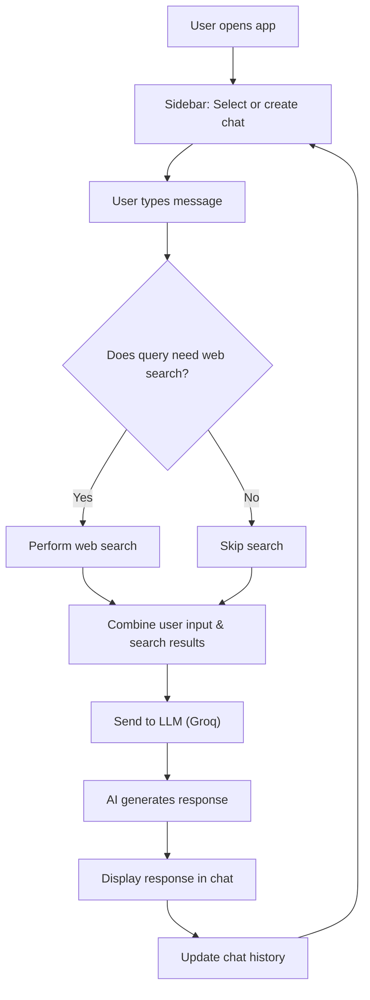

# AI Chat Assistant

A modern conversational AI chat app built with Streamlit and LangChain, featuring web search integration and persistent chat history—all in a single file for simplicity.

## Features
- Multi-chat sessions with independent memory
- Web search integration for up-to-date answers
- Modern, visually appealing UI
- Chat history management (create, switch, delete)
- Context-aware, conversational AI responses

## Setup

### 1. Clone the repository
```bash
git clone https://github.com/yourusername/ai-chat-assistant.git
cd ai-chat-assistant
```

### 2. Install dependencies
```bash
pip install -r requirements.txt
```

### 3. Configure API Keys
Create a `.env` file in the project root:
```env
GROQ_API_KEY=your_groq_api_key
TAVILY_KEY=your_tavily_api_key
```

### 4. Run the App
```bash
streamlit run main.py
```

---

## Architecture

```
main.py           # All logic and UI in a single file
requirements.txt  # Python dependencies
.env              # API keys (not committed)
```

- **main.py**: Handles the Streamlit UI, chat input/output, session state, LLM, and web search logic.

---

## Example Usage

1. **Start a new chat:**
   - Click "➕ New Chat" in the sidebar.
2. **Send a message:**
   - Type your question in the chat input and press Enter.
3. **Web search:**
   - Use words like "current", "latest", or "today" to trigger web search.
4. **Switch or delete chats:**
   - Click on a chat title to switch, or the 🗑️ icon to delete.

---

## Application Flow


---

## License
MIT License
